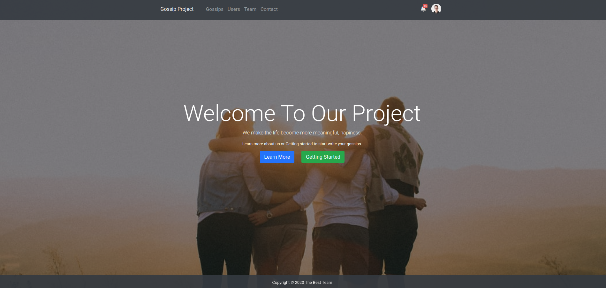

# THP Gossip Project

Check demo of project at : [https://td-gossip.herokuapp.com](https://td-gossip.herokuapp.com)

This is my completed gossip project at The Hacking Project
  - Using Bcrypt for password_hash
  - Using Session to store current_user logged
  - Home page: Landing page show the last gossips and all gossips with color card
  - CRUD: Gossip
  - CRU : User
  - System comments for gossips
  - System Like for gossip by user
  - System Tag of gossip
  - Pagination
  

# The Gossip Project - Views v4.0
_l'app putasse_

<div style="text-align:center" align="center">
  
</div>

## Application

Social network for sharing and commenting on gossip, created as part of The Hacking Project

## Installation

- Pre-install bundle et gem dependencies.
  ```
  $ bundle install
  $ bundle update
  ```
- Configuration de data base.
  
  We use the postgres as the database. To run this project with your local postgres, you need have or create an user for the postgres database.

  >username: postgres
  >password: postgres

  If you don't want to configure this user on your computer. You just need to replace your username/password in the `config / database.yml` file

  ```yml
  development:
  <<: *default
  database: bairbnb_development
  host: localhost
  username: <<your-user-name>>
  password: <<your-password>>
  ```

- Run the database on your computer
  
  ```bash
  $ rails db:create #ou rails db:create:all #ou rake db:create:all
  $ rails db:migrate
  $ rails db:seed
  ```


## Contributeurs

- [:fire: Stanislas BASQUIN](https://github.com/StanislasBASQUIN)
- [:v: Tien Duy NGUYEN](https://github.com/tienduy-nguyen)
- [:v: Hugo Péran Séjourné](https://github.com/HugoPeranSejourne)
- [:seedling: Mathieu JOLY](https://github.com/mathieu-superpose)
- [:seedling: Vivien Ploix](https://github.com/Vivien-Ploix)
- [:fire: Chérif BA](https://github.com/barifche)


## Images projects
<div style="margin-top: 10px; text-align: center; align-item: center">

  
  
  
  
  

</div>